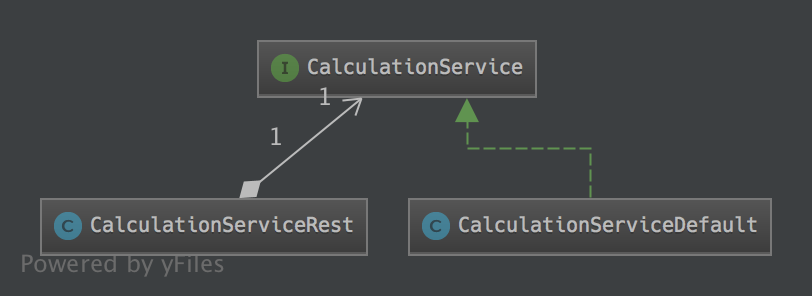

# Microservice Development

This demo is divided into modules. Each module will increase the complexity.
 
## Module 01
In this module we are starting with a "normal" Microservice. The dependency to the
[RapidPM - Microservice]( http://www.java-microservice.org) , a MicroKernel based on Undertow, will be used 
to realize a small demo. It shows how you could organize it, and how you could write the tests
with jUnit.



The Service itself is really simple and provides only one method.

```java
public interface CalculationService {

  default Optional<Integer> add(final List<Integer> values) {
    return (values == null)     ? Optional.empty() :
           (values.size() == 1) ? Optional.ofNullable(values.get(0)) :
                                  Optional.of(values.stream().filter(Objects::nonNull).mapToInt(value -> value).sum());
  }

  default Optional<Integer> add(final Supplier<List<Integer>> values) {
    return (values == null) ? Optional.empty() : add(values.get());
  }
}
```
Based on the default behavior, you could find an implementation. The only difference here 
in this example is that the stream will be a parallel one.

Now we are ready to make a MicroService out of it. For this we are wrapping the Service 
into a REST Endpoint.

```java
@Path("/service/calculation")
public class CalculationServiceRest {

  public static final String PATH_ADD = "add";
  public static final String VALUE_LIST = "valueList";

  //@formatter:off
  public static final Type INPUT_TYPE = new TypeToken<List<Integer>>() { }.getType();
  public static final Type OUTPUT_TYPE = new TypeToken<Optional<Integer>>() { }.getType();
  //@formatter:on

  @Inject CalculationService calculationService;

  @GET()
  @Path(PATH_ADD)
  @Produces(MediaType.APPLICATION_JSON)
  public String add(@QueryParam(VALUE_LIST) final String values) {
    final Gson gson = new Gson();
    try {
      final String decode = new String(new BASE64Decoder().decodeBuffer(values));

      final List<Integer> intList = gson.fromJson(decode, INPUT_TYPE);
      final Optional<Integer> add = calculationService.add(intList);
      return gson.toJson(add, OUTPUT_TYPE);
    } catch (IOException e) {
      e.printStackTrace();
    }
    return gson.toJson(Optional.empty(), OUTPUT_TYPE);
  }
}
```
Now we have a Microservice that will serve this single REST-based method ```add```

But how we could test this? Let´s start with the basic jUnit Tests. First we could define the API tests, 
to make sure the contract will be fulfilled by every implementation. The default behavior was directly implemented 
as default implementation inside the interface. This will lead us to a Test-Suite that will be based on this Interface.

To define the input/output for the API-tests we are using the class ```Tuple```

```java
public class Tuple<I,O> {

  public Tuple(final Supplier<List<I>> input, final Optional<O> output) {
    this.input = input;
    this.output = output;
  }

  private Supplier<List<I>> input;
  private Optional<O> output;

  public Supplier<List<I>> input(){ return input; }

  public Optional<O> output(){return output;}

}
```
Here we are able to hold the combination of input values and the expected output value.

```java
  //data sets
  public static final Tuple<Integer, Integer> dataset001 = new Tuple<>(() -> null, Optional.empty());
  public static final Tuple<Integer, Integer> dataset002 = new Tuple<>(() -> Collections.singletonList(1), Optional.of(1));
  public static final Tuple<Integer, Integer> dataset003 = new Tuple<>(() -> Arrays.asList(1, 2), Optional.of(3));
  public static final Tuple<Integer, Integer> dataset004 = new Tuple<>(() -> Arrays.asList(1, null), Optional.of(1));
```

The generic API-tests are quite simple. We could define nearly everything. The only part that is missing, is the
iinstance of the real implementation. For this we could define an abstact method called ```createSupplier()```.

```java
  public static final Function<Optional<Integer>, Optional<Integer>> notNull = (integerOptional) -> {
    Assert.assertNotNull(integerOptional);
    return integerOptional;
  };

  public static final BiFunction<Optional<Integer>, Optional<Integer>, Optional<Integer>> equals = (optionalA, optionalB) -> {
    Assert.assertEquals(optionalA, optionalB);
    return optionalB;
  };

  protected abstract Supplier<CalculationService> createSupplier();

  @Test
  public void apiTest001() throws Exception {
    equals.apply(
        dataset001.output(),
        notNull.apply(
            createSupplier().get().add(dataset001.input())));
  }

  @Test
  public void apiTest002() throws Exception {
    equals.apply(
        dataset002.output(),
        notNull.apply(
            createSupplier().get().add(dataset002.input())));
  }

  @Test
  public void apiTest003() throws Exception {
    equals.apply(
        dataset003.output(),
        notNull.apply(
            createSupplier().get().add(dataset003.input())));
  }

  @Test
  public void apiTest004() throws Exception {
    equals.apply(
        dataset004.output(),
        notNull.apply(
            createSupplier().get().add(dataset004.input())));
  }

```

To define the tests for the interface with the default implementations we are writing 
the first implementation based on the API-Test-class.

```java
public class CalculationServiceTest extends CalculationServiceAPITest {
  @Override
  protected Supplier<CalculationService> createSupplier() {
    return ()-> new CalculationService() {};
  }
  // here additional tests
}
```

And for the parallel implementation...

```java
public class CalculationServiceDefaultTest extends CalculationServiceAPITest {
  @Override
  protected Supplier<CalculationService> createSupplier() {
    return CalculationServiceDefault::new;
  }
  // add special Tests here
}
```

OK, with this we are able to test all implementations against the default behavior.

the next step is now: testing the microservice. Testing Microservices means, that we have to start 
the microservice itself before we are running our tests via REST.

